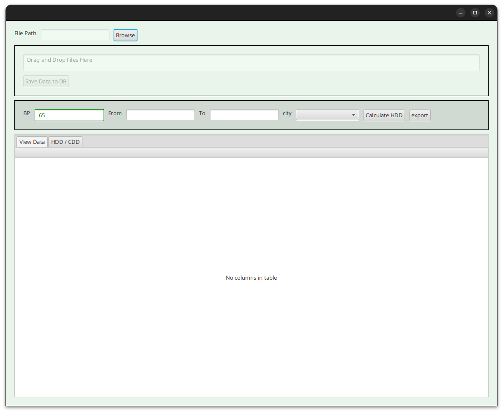

<div align="center" id="top"> 
  

&#xa0;

  <!-- <a href="https://calculate-temperature.netlify.app">Demo</a> -->
</div>

<h1 align="center">Temperature calculation from csv file (JavaFx with Spring) </h1>

<p align="center">
  

  

  

  

  <!--  -->

  <!--  -->

  <!--  -->
</p>

<!-- Status -->

<!-- <h4 align="center"> 
	🚧  Temperature calculation 🚀 Under construction...  🚧
</h4> 

<hr> -->

<p align="center">
  <a href="#dart-about">About</a> &#xa0; | &#xa0; 
  <a href="#sparkles-features">Features</a> &#xa0; | &#xa0;
  <a href="#rocket-technologies">Technologies</a> &#xa0; | &#xa0;
  <a href="#white_check_mark-requirements">Requirements</a> &#xa0; | &#xa0;
  <a href="#checkered_flag-starting">Starting</a> &#xa0; | &#xa0;
  <a href="#memo-license">License</a> &#xa0; | &#xa0;
  <a href="https://github.com/Abdelouahedd" target="_blank">Author</a>
</p>

<br>

## :dart: About ##
This project is a simple application for calculate the temperature from csv file, 
The main goal is to create a desktop application with the framework JavaFx and spring boot for the backend and maven for the build tool. 
The application is a simple application for calculate the temperature from csv file, the user can upload a csv file and the application 
will calculate the temperature from the file and return the result in a table. The application can be used for calculate the temperature in a lot 
of fields like the medicine and the food industry.

## :rocket: Technologies ##

The following tools were used in this project:

- [Spring](https://spring.io/)
- [Maven](http://maven.apache.org/)
- [Java 17](https://www.java.com/)

## :white_check_mark: Requirements ##

Before starting :checkered_flag:, you need to have [Git](https://git-scm.com)

## :checkered_flag: Starting ##

```bash
# Clone this project
$ git clone https://github.com/Abdelouahedd/calculate-temperature

# Access
$ cd calculate-temperature

# Install dependencies
$ mvn clean install

# Run the project
$ mvn spring-boot:run

# The server will initialize in the <http://localhost:9000>
```

## :memo: License ##

This project is under license from MIT. For more details, see the [LICENSE](LICENSE.md) file.


Made with :heart: by <a href="https://github.com/Abdelouahedd" target="_blank">Abdelouahedd</a>

&#xa0;

<a href="#top">Back to top</a>
